# WordList-Gen:
  A passwords wordlist generator. It generates wordlists from names and vehicles' numbers as exmplained in followings.

## Installation:
  Download entire project and cd into root of program than run 'generate.py' with python3.
  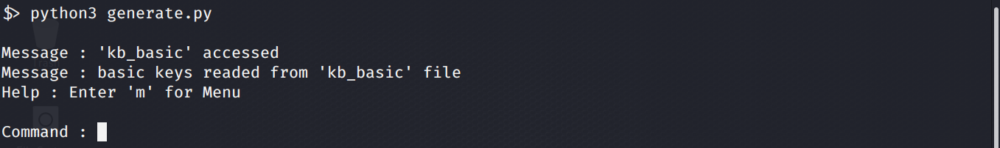

## Description:
  After running program, first open menu by entering 'm'.
  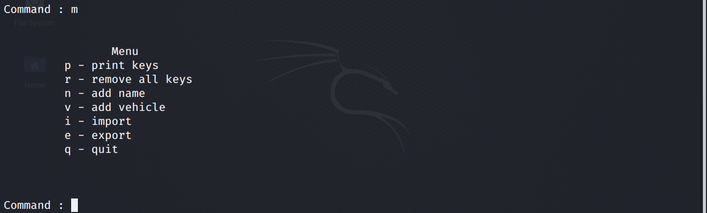

## 1. Print Keys:
  'p' command prints added keys. Some basic keys are added in program that are imported from 'kb_basic' file. So you can simple view these keys without adding any more by pressing 'p' command.
  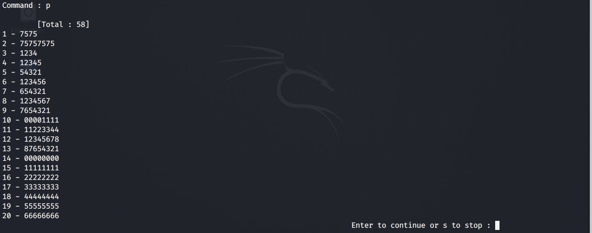

## 2. Remove Keys:
  'r' command removes all existing keys.
  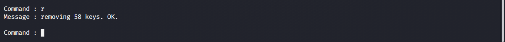

## 3. Adding Keys from Name:
  'n' command adds keys from name. It first takes an input of fill name seperated by spaces (maximum four words allowed at a time).
  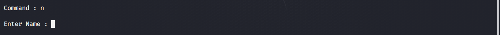
  Then it asks for configration. to be manual or auto. If manual selected. user specify which possibilities are to be used and which one should be eliminated.
  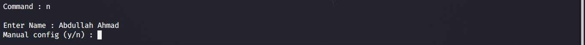
  type y for yes and n for no for each configration option
  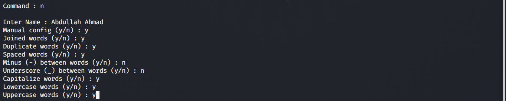
  After providing information, program generated keys and stores in memory.
  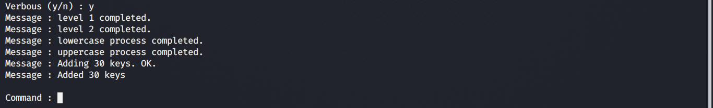
  Now you can see (by 'p' command) that keys are generated from given configration.
  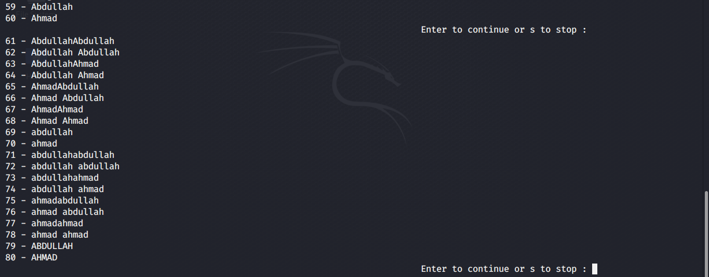
  
## 4. Adding Keys from Vehicle #:
  Adding a vehicle number is most like adding name. First enter number.
  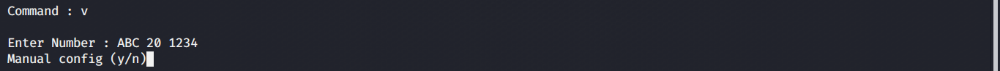
  You can manually configure by 'y' or 'n' for default configration.
  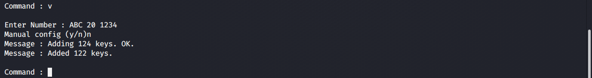
  Let's check out keys in memory (by 'p')
  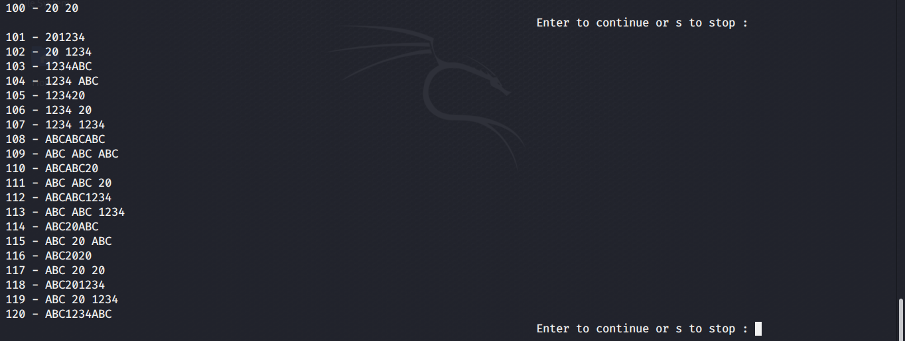
  
## 5. Import from file:
  words can be imported from file by 'i' command. [note that words must be seperated by newlines (\n).]
  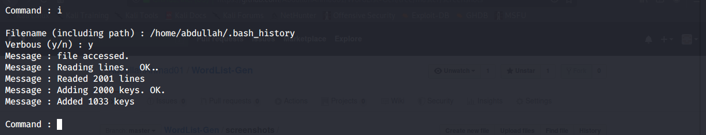
 
## 6. Export to file:
  export ('e') command exports all keys in memory into a file.
  
  next it asks that what to do with keys that are less than '8' number of characters.
  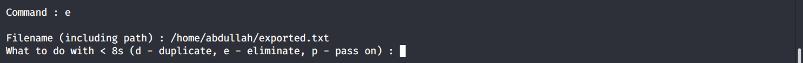
  These keys are usually eliminated (e)
  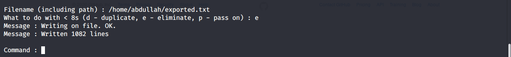
  Finally, wordlist is created as exported file
  
## 7. Quit:
  'q' command exits from program and return to bash prompt.
  
